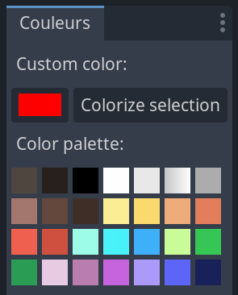

# GodotColorizer
Colorize MeshInstance3D in 1 click

## How to install
Copy "colorizer" folder inside the "addons" folder of your Godot project and activate the plugin in the project settings.

## How to use it
Select one or multiple MeshInstance3D in your scene and then, click on a palette color or click on the colorize button to color your selection.

